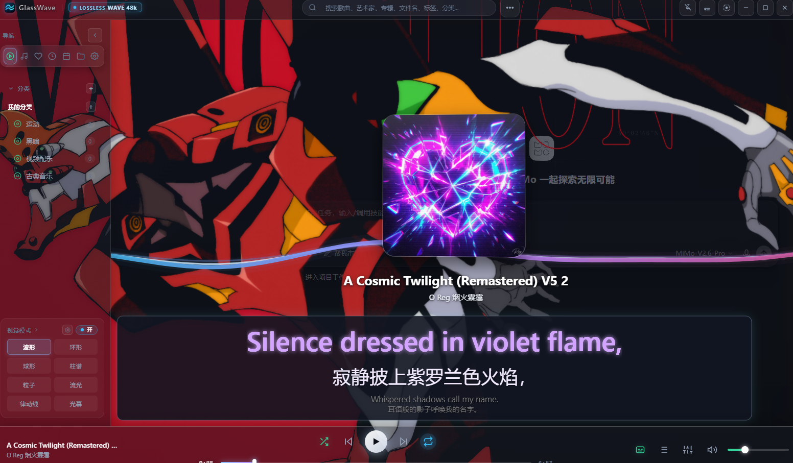

# GlassWave

GlassWave 是一款 Windows 本地音乐播放器，提供波形与频谱视效、可保存的完整皮肤、均衡器和极简播放界面。音乐文件留在本机，程序可从指定文件夹扫描曲库。

## 下载

到 [Releases](../../releases) 下载 `GlassWave-v1.2.4-win-x64.zip`，解压后运行 `GlassWave.exe`。便携版的设置和曲库索引保存在程序旁的 `data` 文件夹；更新程序时保留这个文件夹。下载包内置 O Reg 的《The Pattern》及专属封面，作为首次启动的示例曲目。完整功能介绍见 [功能与界面预览](RELEASE_NOTES_1.2.1.md)，新增歌词、实时卡拉 OK、全部配色更新及累计修复见 [1.2.4 更新说明](RELEASE_NOTES_1.2.4.md)。

## 本地歌词与卡拉 OK

底栏歌词按钮左键显示／隐藏，右键打开歌词菜单。支持 LRC、ELRC、YRC、JSON、TXT、内嵌歌词和独立歌词库；有逐字时间轴时按播放进度填色，普通 LRC 按句高亮。支持双语译文、三组文字颜色、冰蓝／紫色／暖金预设、独立字号、荧光、暗色半透明背景及自由拖动／缩放，外观可随自定义皮肤保存。



## 从源码运行

在 Windows 上安装 Node.js 与 npm，然后运行：

```powershell
npm install
npm start
```

打包为 Windows 应用目录：

```powershell
npm run pack
```

生成的目录在 `dist/win-unpacked`。需要便携数据目录时，在 `GlassWave.exe` 旁创建 `data` 文件夹；否则设置保存在系统用户数据目录。打包依赖 Electron 和 electron-builder，首次安装或打包需要下载相关依赖。

## 快捷键

软件获得焦点时，`Ctrl+Shift+S` 可以在当前外观与下一套已保存皮肤之间往返切换。正常界面、极简界面和极简条状界面均可使用，切换皮肤不会切换当前界面模式。其他快捷键可在软件的设置中查看和修改。

## 许可

项目源码与界面素材采用 [MIT License](LICENSE)。下载包内置的《The Pattern》录音和专属封面版权归 O Reg 所有，不包含在 MIT 授权范围内；参见下载包的 `MUSIC-LICENSE.txt`。Electron 及其他第三方依赖保留各自的许可；Windows 下载包附带相应的第三方许可文件。
