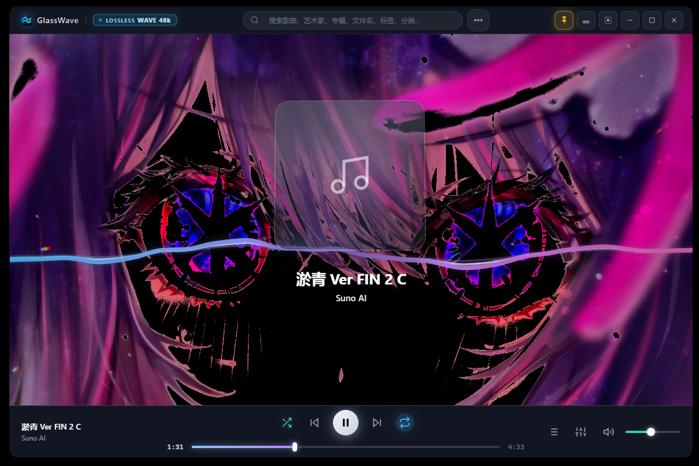
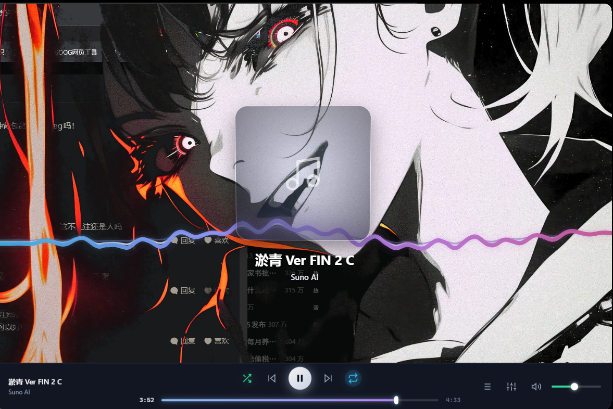
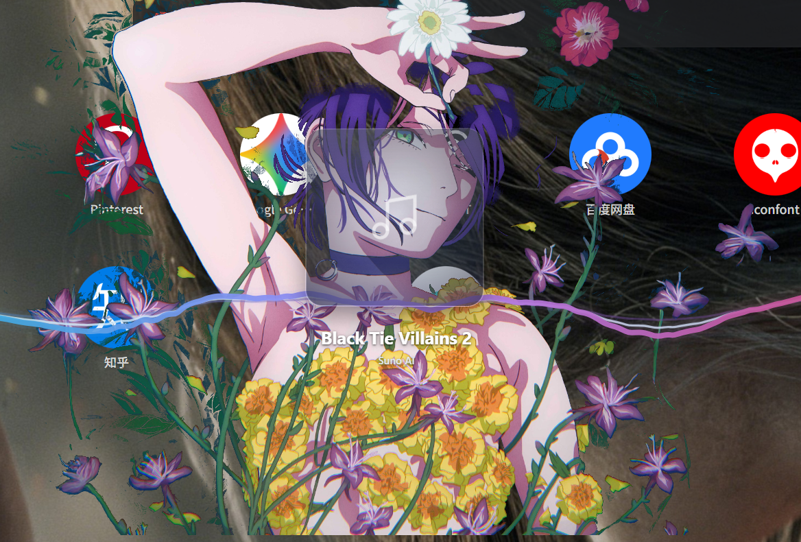
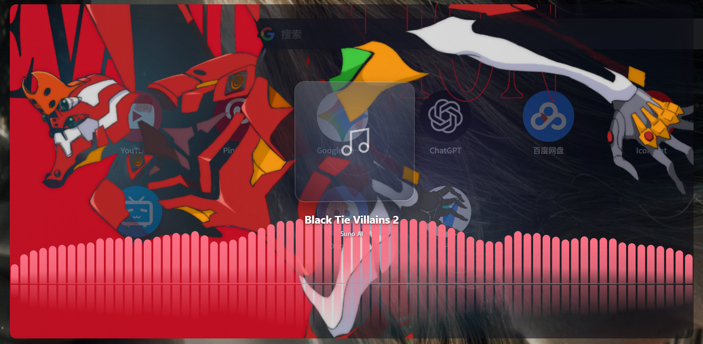

# GlassWave 1.2.1

Windows x64 便携版。下载 `GlassWave-v1.2.1-win-x64.zip`，解压后运行 `GlassWave.exe`。

GlassWave 把本地音乐播放、实时音频视效和可保存的完整界面皮肤放在同一个窗口中。下面列的是实际可用的区别和细节，而不只是视觉效果名称。

## 界面预览

| 波形与壁纸 | 极简播放界面 |
| --- | --- |
|  |  |
| 桌面透光与背景混合 | 柱谱与倒影 |
|  |  |

## 与常见本地播放器相比

| 方面 | GlassWave 的做法 |
| --- | --- |
| 八种实时视效 | 波形、环形、球形、柱谱、粒子、流光、律动线和光幕可以直接切换，播放时由音频驱动。 |
| 荧光三线 | 波形与律动线包含三线效果；线条分层、颜色和波动响应可调，1.2.1 默认线宽为 8px。 |
| 单独调每种视效 | 每种模式保存自己的配色、灵敏度、屏幕位置与大小；调整波形不会覆盖球形或柱谱的设置。 |
| 深入的音频响应 | 可调视觉灵敏度、平滑与瞬态等参数，也能控制律动线的流动方向、流动与振动时的分离感。 |
| 大屏渲染 | 提供 60 / 90 FPS 目标选项及针对高分辨率全屏的渲染控制。实际帧率取决于显示器和硬件。 |
| 背景与视效分开 | 可以只重置背景图片和动态光球，不动当前视觉模式；视效则有“重置当前”和“重置全部”。 |
| 可换整套界面颜色 | 背景、面板、强调色和选中状态可分别设色，也有深色玻璃、浅色玻璃、暖白、冷灰蓝与跟随封面等预设。 |
| 背景混合 | 支持本地壁纸、背景模糊、桌面透光，以及黑底或白底背景的透明化处理。 |
| 完整皮肤预设 | 保存和导入皮肤时包含背景图片、透明度、界面配色、动态效果和视觉设置；预设可用缩略图查找。 |
| 不改变布局的换肤 | 窗口获得焦点时按 `Ctrl+Shift+S` 切换已保存皮肤；普通、极简和条状模式保持各自当前布局。 |
| 多种窗口形态 | 完整界面、极简界面与极简条状界面可按使用场景切换；极简横排导航的 Dock 默认开启。 |
| 本地曲库监控 | 添加音乐目录后持续监控文件变化，也可以手动导入；收藏、最近播放、最近添加都在软件内查看。 |
| 两级分类 | 可以新建、重命名和删除一级分类及其二级分类，按自己的方式整理歌曲。 |
| 批量整理 | `Shift` 多选歌曲后可通过右键菜单批量移到另一二级分类；分类移动不改变磁盘上的文件位置，也不从“所有歌曲”移除。 |
| 文件级去重 | 分类操作按音乐文件身份识别，不靠歌曲标题去重，避免同名不同文件混淆。 |
| 标签管理 | 可给歌曲加标签并按标签筛选，也可以在总标签管理中全局删除标签，同时从相关歌曲移除。 |
| 七段均衡器 | 60、150、400、1000、2400、6000、15000 Hz 七段调节，可保存自己的预设。 |
| 播放控制 | 支持播放队列、随机/循环、音量与进度调节；断点继续播放可按需开启。 |
| 可改快捷键 | 设置内可以查看和修改快捷键；软件窗口未获得焦点时，换肤快捷键不抢占其他应用。 |

## 1.2.1 更新

| 功能 | 变化 |
| --- | --- |
| 极简导航 | 横排 Dock 默认开启；已经手动关闭的用户继续保持关闭。 |
| 视觉参数 | 将预览版微调后的参数设为“重置当前”和“重置全部”的默认值；各视效独立保存配色、灵敏度、位置与大小。 |
| 分类与标签 | 两级分类支持重命名、批量移动和文件级去重；标签可以统一删除。 |
| 皮肤与壁纸 | 视觉配色写入自定义皮肤；选择本地背景图片时记住上次使用的文件夹；背景重置只恢复背景和默认动态光球。 |

## 修复与性能

| 问题 | 修复 |
| --- | --- |
| 全屏、拖动时闪烁或卡顿 | 移除旧整窗模糊及拖动时的画质切换，避免重复清空背景画布；曲库监控延后到窗口显示后启动。 |
| 极简模式侧边栏和底边栏突兀地截断内容 | 内容页保持导航可见，并用挤压动画调整空间；视觉设置打开时锁定底边栏。 |
| 窗口底部右键菜单被裁切 | 按实际菜单尺寸限制弹出位置。 |
| 系统设置与当前播放队列顶部出现空隙 | 统一抽屉位置与标题栏尺寸。 |
| 90 FPS 被错误标成 60 FPS | 修正显示文字及旧设置兼容值。 |
| 关闭窗口后托盘图标残留 | 关闭主窗口时完整退出应用。 |
| 正在播放的歌曲与多选状态混淆 | 两种状态使用不同视觉提示，叠加时仍可辨认。 |

《The Pattern》录音及其封面不属于 MIT 授权，详见下载包内 `MUSIC-LICENSE.txt`。
